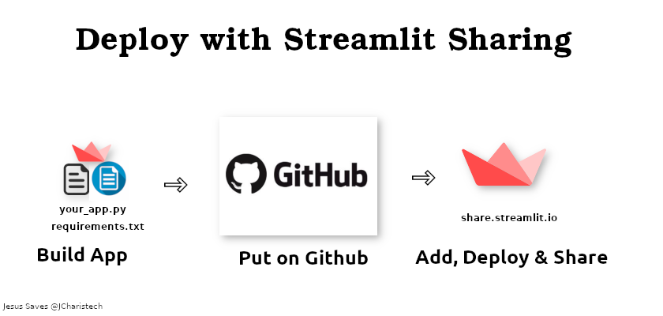

### How to Deploy your Streamlit App using Streamlit Sharing
[](https://share.streamlit.io/jcharis/streamlit-trend-app/)

### Steps

1. You need 
	- Github Account: where you will host the app
	- share.streamlit.io: an invite via your github account email
	- App + Requirements.txt


2. Getting the Requirements.txt
	- Pipenv  pipfile
	- pip freeze > requirements.txt
	- pipreqs /home/project/location


#### Adding the Play Button
```[](https://share.streamlit.io/yourGitHubName/yourRepo/yourApp/)```